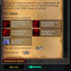

# BestSellButton (WoW AddOn)

&nbsp; &nbsp; &nbsp; &nbsp;

## Description
This addon put an extra button to the questframe (not the questlog) and the button is only visible if you can choose an reward item. A click on this buttons select the item with the highest vendor price. After this action you can push the quest complete button or change the selected reward.

## Optional extra
Indicator icons for unsaleable and highest vendor price on reward items.

## My other projects
* [On Curseforge](https://www.curseforge.com/members/hizuro_de/projects)
* [On Github](https://github.com/HizurosWoWAddOns?tab=repositories)

## Disclaimer
> World of Warcraft© and Blizzard Entertainment© are all trademarks or registered trademarks of Blizzard Entertainment in the United States and/or other countries. These terms and all related materials, logos, and images are copyright © Blizzard Entertainment.
